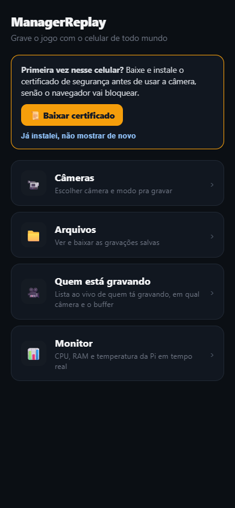
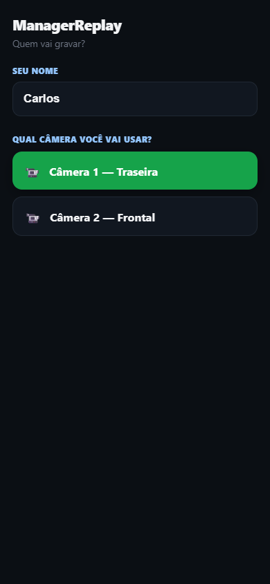
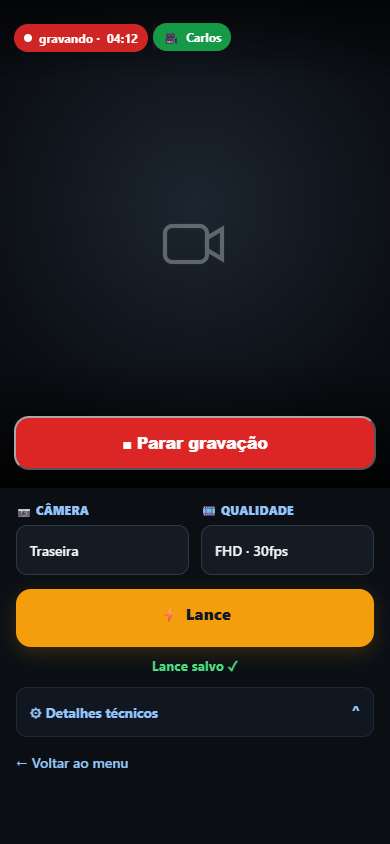
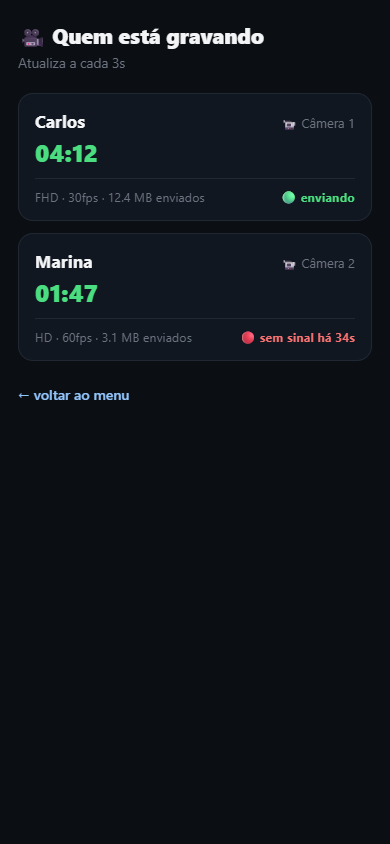
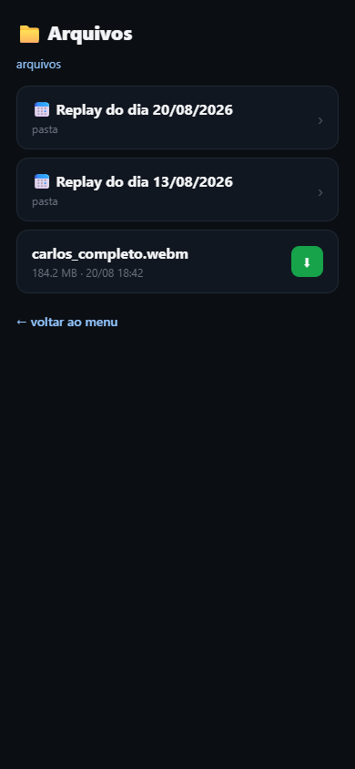
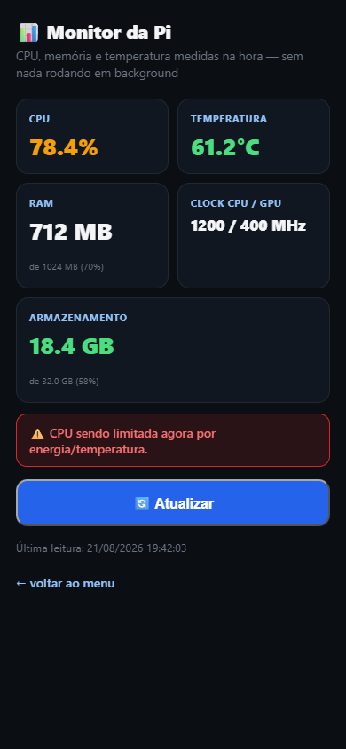

# ManagerReplay

Sistema portátil de gravação de partidas esportivas (futebol, vôlei, etc.) que usa os celulares dos próprios jogadores como câmeras, sem depender de câmeras esportivas dedicadas ou de internet. O servidor roda num Raspberry Pi 3B, que cria a própria rede Wi-Fi (hotspot) e os celulares se conectam nela como câmeras — tudo pelo navegador, sem instalar nada.

Contexto completo do produto, decisões de arquitetura e riscos técnicos em [`ContextoProjeto.md`](ContextoProjeto.md).

## Telas

<table>
  <tr>
    <td align="center"><br>Início</td>
    <td align="center"><br>Câmeras</td>
    <td align="center"><br>Gravação</td>
  </tr>
  <tr>
    <td align="center"><br>Quem está gravando</td>
    <td align="center"><br>Arquivos</td>
    <td align="center"><br>Monitor</td>
  </tr>
</table>

## Como funciona

1. A Raspberry Pi liga e sobe sozinha — hotspot Wi-Fi aberto e o app já rodando, sem precisar de SSH nem tela.
2. Os celulares conectam nesse Wi-Fi e acessam `https://<ip-do-hotspot>:8443/` pelo navegador (dá pra "Adicionar à tela inicial" pra virar um ícone de app de verdade, com ícone próprio).
3. Na primeira vez, o celular baixa e instala o certificado de segurança direto pelo app (banner na tela inicial).
4. Quem vai gravar digita o nome e escolhe a câmera: **Câmera 1 é sempre a traseira**, **Câmera 2 é sempre a frontal** — o seletor de dispositivo só mostra as lentes daquele lado.
5. Antes de gravar, escolhe a qualidade (HD/FHD, 30/60fps) e aperta **● Iniciar gravação**. O vídeo é enviado em pedaços de 30s pro Pi (trocar de câmera no meio da gravação não reinicia a sessão — só troca a lente ao vivo).
6. Depois de 30s de gravação, o botão **⚡ Lance** libera — aperta pra marcar um momento importante (nome tipo "LanceEpico 003" + timestamp, com vibração e flash de confirmação).
7. **📹 Quem está gravando** mostra ao vivo quem está com a câmera ativa, em qual câmera, e se está enviando dados normalmente.
8. **📁 Arquivos** lista as gravações organizadas por dia, com download direto.
9. **📊 Monitor** mostra CPU/RAM/temperatura/armazenamento da Pi sob demanda (sem nada rodando em background).

## Stack

- **Backend**: Python (stdlib `http.server`, sem framework) — modo `webrtc` via `aiohttp`/`aiortc` existe no código mas não é usado pela UI atual (só `chunks` está exposto).
- **Frontend**: HTML/CSS/JS puro, servido direto pelo backend — sem build step, sem framework JS.
- **Rede**: HTTPS obrigatório (câmera do navegador exige contexto seguro), certificado gerado localmente com [mkcert](https://github.com/FiloSottile/mkcert). PWA instalável (manifest + ícones) pra virar um app de verdade na tela inicial.

## Estrutura do repositório

```
server/                  pacote Python do servidor (o nome da pasta importa — veja nota abaixo)
├── app.py               entrypoint CLI
├── chunks_receiver.py   servidor HTTPS (modo chunks, via stdlib http.server) — rotas da API
├── webrtc_receiver.py   servidor HTTPS (modo webrtc, via aiohttp/aiortc — não usado pela UI hoje)
├── storage.py           onde/como os vídeos são salvos (pastas por dia, nome por câmera+sessão+parte)
├── events.py            registro dos "lances" (events.jsonl)
├── sessions.py           quem está gravando agora (estado em memória, pra tela "Quem está gravando")
├── file_listing.py      listagem de diretório pro explorador de arquivos
├── monitor_status.py    leitura sob demanda de CPU/RAM/temperatura/disco da Pi
└── static/               HTML/CSS/JS servido pro navegador do celular
    ├── index.html         menu inicial + banner de instalação do certificado
    ├── cameras.html        nome do operador + escolha de câmera (1=traseira, 2=frontal)
    ├── capture.html         tela de gravação (vídeo, qualidade, lance, troca de câmera ao vivo)
    ├── gravando.html        quem está gravando agora, ao vivo
    ├── files.html           explorador de arquivos gravados
    └── monitor.html         saúde da Pi sob demanda
deploy/systemd/          unit files pro servidor subir sozinho no boot
tests/server/             testes automatizados (pytest)
docs/superpowers/         specs, planos e runbooks de decisões de design
```

> **Importante**: o pacote Python se chama `server` (é o que o código importa via `from server import ...`). Ao fazer deploy, a pasta no destino **precisa se chamar `server`** — renomear quebra o import.

## Rodando os testes

```bash
python3 -m venv .venv
.venv/bin/pip install -r server/requirements.txt -r server/requirements-dev.txt
.venv/bin/python -m pytest tests/server/ -v
```

## Deploy no Raspberry Pi

Layout esperado na Pi, tudo sob `~/managerreplay/`:

```
~/managerreplay/
├── server/        código + venv (.venv/)
├── data/
│   ├── recordings/       vídeos gravados, uma pasta por dia (YYYY-MM-DD/cameraN_<sessão>_parteN.webm)
│   └── events.jsonl      lances registrados
└── certs/         certificado HTTPS (leaf cert + key do mkcert)
```

1. **Sincronizar o código**:
   ```bash
   rsync -av --exclude .venv --exclude __pycache__ server/ rocha@<ip-da-pi>:~/managerreplay/server/
   ```
2. **Sincronizar a versão** (bump o número em `VERSION` antes de commitar qualquer mudança que valha marcar como nova versão; depois copie o arquivo pra Pi):
   ```bash
   scp VERSION rocha@<ip-da-pi>:~/managerreplay/VERSION
   ```
   A tela **Monitor** mostra esse número — depois de um deploy, confira lá se bate com o que você esperava, como forma de confirmar que o deploy realmente pegou.
3. **Gerar o certificado HTTPS** (uma vez, ou quando o IP do hotspot mudar):
   ```bash
   mkcert -install
   mkdir -p ~/managerreplay/certs && cd ~/managerreplay/certs
   mkcert <ip-do-hotspot>   # ex: mkcert 10.42.0.1
   ```
4. **Subir o servidor** — via systemd (ver seção abaixo, recomendado) ou manualmente pra testar:
   ```bash
   cd ~/managerreplay/server
   .venv/bin/python app.py --mode=chunks --cameras=1 \
     --cert ~/managerreplay/certs/<ip>.pem --key ~/managerreplay/certs/<ip>-key.pem
   ```

`--cameras` aceita de 1 a 5 — cada número corresponde a uma posição fixa no campo mostrado em `cameras.html` (1=Gol A, 2=Gol B, 3=Arquibancada A, 4=Arquibancada B, 5=Geral). Lado A (azul) = câmeras 1 e 3; Lado B (vermelho) = câmeras 2 e 4.

`--storage-root` e `--events-file` já usam `~/managerreplay/data/...` por padrão — só precisam ser passados se quiser outro local.

### Gravando num pendrive/SSD USB externo

A tela **Monitor** detecta automaticamente qualquer pendrive/SSD USB montado na Pi (qualquer dispositivo `/dev/sdX` — a Pi não tem SATA embutido, então isso nunca é confundido com o cartão SD, que é sempre `/dev/mmcblk0...`) e mostra um card **"Local de gravação"** com o cartão SD e qualquer drive externo montado, cada um com o espaço livre — basta escolher e clicar em "Usar este local" pra trocar o destino das próximas gravações, sem precisar mexer em configuração nem reiniciar o servidor.

Detalhes técnicos de como isso funciona (`chunks_receiver.py`):

- **`GET /storage-options`** lista o cartão SD (`default_storage_root`, fixado na inicialização) + qualquer `/dev/sdX` detectado via `detect_external_storage()`, com espaço livre/total de cada um.
- **`POST /storage-select?path=<...>`** troca `ChunksUploadHandler.storage_root` (um atributo de classe, protegido por `sessions_lock`) pro caminho escolhido. Um drive externo grava numa subpasta própria (`<mountpoint>/managerreplay-recordings/`), nunca solto na raiz do drive — evita misturar arquivos do app com o que já estiver lá.
- **Trava de segurança**: a troca é recusada com `409` se `sessions_registry` não estiver vazio (alguma câmera gravando agora). Isso evita que um upload em andamento tente escrever no destino errado no meio da troca.
- **Não é persistente** entre reinícios do servidor — sempre volta pro cartão SD no boot. Isso é deliberado: se o pendrive for removido enquanto a Pi está desligada, ela ainda sobe normalmente gravando no SD, em vez de falhar tentando um caminho que não existe mais.
- A tela de Arquivos (`files.html`) e a listagem de lances sempre refletem o `storage_root` **atualmente ativo** — não existe uma visão unificada mostrando gravações de ambos os locais ao mesmo tempo. Se trocar de local no meio do dia, as gravações feitas antes da troca continuam existindo no local antigo, só não aparecem mais em Arquivos até trocar de volta.

O mesmo card tem um botão **"Ejetar"** ao lado de cada drive externo — roda `sync` (força gravar tudo que ainda estiver em cache) e depois `umount`, pra poder tirar o pendrive/SSD fisicamente sem risco de corromper o sistema de arquivos. Recusado com `409` se alguma câmera estiver gravando; se o drive ejetado era o destino ativo, a gravação já volta pro cartão SD automaticamente antes de desmontar.

**Pré-requisito**: como o servidor roda como o usuário `rocha` (não root), desmontar exige uma permissão de `sudo` sem senha pro `umount`, configurada uma vez na Pi:

```bash
echo "rocha ALL=(ALL) NOPASSWD: /usr/bin/umount /media/*" | sudo tee /etc/sudoers.d/managerreplay-umount
sudo chmod 440 /etc/sudoers.d/managerreplay-umount
```

(ajuste `/usr/bin/umount` se `which umount` apontar pra outro caminho na sua instalação, e o padrão `/media/*` se você monta os drives em outro lugar). Sem isso, o botão "Ejetar" vai falhar com erro 500 pedindo senha de forma não-interativa.

Ainda dá pra fixar o destino via `--storage-root` na hora de subir o servidor (útil se você sempre grava no mesmo drive externo e quer pular a seleção manual toda vez):

```bash
.venv/bin/python app.py --mode=chunks --cameras=1 \
  --storage-root /media/rocha/SSD1/managerreplay-recordings \
  --cert ~/managerreplay/certs/<ip>.pem --key ~/managerreplay/certs/<ip>-key.pem
```

## Hotspot Wi-Fi da Pi

Criado uma vez via `nmcli` (rede aberta, sem senha — evita um bug conhecido de kernel panic do chip Wi-Fi do Pi 3B em modo AP com WPA2, ver `ContextoProjeto.md` Risco 4):

```bash
sudo nmcli connection add type wifi ifname wlan0 con-name ManagerReplay-Hotspot autoconnect yes ssid ManagerReplay-Hotspot
sudo nmcli connection modify ManagerReplay-Hotspot 802-11-wireless.mode ap 802-11-wireless.band bg ipv4.method shared
sudo nmcli connection up ManagerReplay-Hotspot
```

`autoconnect yes` faz o hotspot subir sozinho a cada boot (testado com reboot real). Se a Pi já tiver um perfil de Wi-Fi doméstico salvo, remova-o (`nmcli connection delete <nome>`) — senão o `wlan0` pode preferir reconectar nele em vez de subir o hotspot.

## Autostart no boot (systemd) — jogo sem SSH

Pra usar num campo/quadra sem levar notebook: a Pi precisa subir o hotspot e o servidor sozinha ao ligar. O hotspot já sobe sozinho (seção acima). O servidor sobe via systemd:

```bash
sudo cp deploy/systemd/managerreplay-server.service /etc/systemd/system/
sudo systemctl daemon-reload
sudo systemctl enable --now managerreplay-server
```

O arquivo `.service` já está pronto em [`deploy/systemd/`](deploy/systemd/) — ajuste o caminho do certificado dentro dele se o IP do hotspot for diferente de `10.42.0.1`. `Restart=always` garante que se ele cair, volta sozinho. Log fica no `journalctl -u managerreplay-server`.

**Desligando sem tela/teclado (puxando a energia direto)**: a tela de Monitor mede CPU/RAM/temperatura na hora (via `top`/`free`/`vcgencmd`), sob demanda, só quando alguém abre a tela e aperta "Atualizar" — não existe processo escrevendo continuamente no cartão SD, então não há nada pra corromper com uma queda de energia. As gravações de vídeo continuam no cartão SD normalmente; no pior caso, só o pedaço de ~30s que estava sendo gravado no exato momento de tirar a energia pode ficar incompleto — o resto da gravação (chunks anteriores, já com escrita concluída) fica intacto.

## Instalando o certificado nos celulares

Como o certificado é autoassinado (rede 100% offline, sem CA pública), cada celular precisa confiar no certificado raiz do mkcert uma vez. O app facilita isso: o menu inicial mostra um banner **"Primeira vez nesse celular?"** com um botão que baixa o `rootCA.pem` direto do Pi e o passo a passo de instalação (Android: Configurações → Segurança → Criptografia e credenciais → Instalar um certificado → Certificado de CA).

Esse link só funciona se o `rootCA.pem` do mkcert estiver copiado para `server/static/certs/rootCA.pem` na Pi (não vai para o Git — é específico de cada instalação):

```bash
mkdir -p ~/managerreplay/server/static/certs
cp "$(mkcert -CAROOT)/rootCA.pem" ~/managerreplay/server/static/certs/rootCA.pem
```

**Nunca copie `rootCA-key.pem` (a chave privada da CA) nem os arquivos `*-key.pem` de `~/managerreplay/certs/` pra dentro de `server/static/` — esses arquivos ficam expostos publicamente por HTTP, e a chave privada da CA compromete a segurança de qualquer aparelho que confiar no certificado.**

## Limitações conhecidas

### 60fps nem sempre é entregue de verdade, mesmo quando o celular suporta

O seletor de qualidade em `capture.html` detecta as resoluções que a câmera do aparelho suporta via `track.getCapabilities()` e monta a lista de opções (HD/FHD/4K × 30/60fps) a partir disso — mas **não confie na capability de `frameRate`** reportada por essa API no Android: em testes com um Galaxy S20 FE ela é sistematicamente pouco confiável (chega a reportar `max: 30` num sensor que grava 60fps de verdade no app de câmera nativo). Por isso `client.js` ignora `frameRate` na hora de decidir quais opções mostrar (só filtra por `width`/`height`, que é bem mais estável) e sempre oferece 30 e 60fps juntos pra qualquer resolução suportada.

Na hora de efetivamente pedir a câmera, o código tenta primeiro `frameRate: { min: X }` (exigência forte — falha com `OverconstrainedError` se o aparelho não aguentar) e só cai pro `frameRate: { ideal: X }` (sugestão fraca, nunca falha) se isso não funcionar — ver `requestVideoStream()` em `client.js`. Mesmo assim, em alguns aparelhos (S20 FE incluso) **60fps nunca é entregue via navegador em nenhuma resolução**, mesmo forçando `min`. A causa mais provável: muitos fabricantes Android (Samsung entre eles) só expõem taxas de quadro altas através de uma sessão de captura especial do Camera2 (`CameraConstrainedHighSpeedCaptureSession`), que fica reservada pro app de câmera nativo/vendor — o Chrome (e navegadores em geral) só abre uma sessão de captura "normal", que nesses aparelhos tem teto de 30fps independente do que for pedido.

A tela de gravação assume essa realidade e só **avisa** quando o fps pedido não bate com o entregue (linha "Câmera ativa" em Detalhes técnicos), em vez de fingir que deu certo — ver `updateCameraInfo()` em `client.js`. Por causa disso, a qualidade padrão pré-selecionada é **HD·30fps** (não 60fps) — 60fps continua disponível no seletor pra quem quiser tentar num aparelho que realmente suporte, só não é mais a aposta padrão (`DEFAULT_QUALITY_PRIORITY` em `client.js`).

**Se um futuro desenvolvedor for atrás de 60fps de verdade**, nessa ordem de custo/risco:

1. **Teste em outros navegadores no mesmo aparelho** (Samsung Internet, Firefox Android) — implementações diferentes de captura de câmera às vezes conseguem acessar modos que o Chrome não acessa. Grátis, vale testar antes de qualquer coisa.
2. **Teste em outros aparelhos/marcas** — pode ser uma limitação específica do S20 FE (ou da geração Samsung dele), não universal. Confirme em pelo menos 2-3 modelos diferentes antes de assumir que é um problema geral.
3. **App nativo Android usando Camera2 diretamente** (`CameraConstrainedHighSpeedCaptureSession`) — única forma confiável de garantir 60fps+. Implica abandonar o modelo atual de "abre o link no navegador, sem instalar nada", que é um dos pilares centrais do produto (ver `ContextoProjeto.md`) — e não resolve pra iPhone, que teria que continuar em 30fps de qualquer forma (Safari/iOS tem a mesma limitação de sessão de captura restrita, e o iPhone nunca pode ser hub, só câmera-cliente). Avalie se o ganho (câmera lenta nos lances) compensa esse custo antes de embarcar nisso.

Na prática, 30fps é o padrão de praticamente toda transmissão esportiva e resolve bem o caso de uso — só vale perseguir 60fps se houver uma necessidade concreta de slow-motion nos replays.

## Estado do projeto

O roadmap original (Fases 00–10) está em [`ContextoProjeto.md`](ContextoProjeto.md), seção 9. A validação de capacidade de hardware (Pi aguentando 2 câmeras simultâneas) foi pausada em favor de já estruturar o produto — ainda é uma pergunta em aberto se/quando o time decidir retomar. Fora do escopo por enquanto: SQLite (eventos ainda são JSON Lines), highlights automáticos (cortar 30s antes/depois de um lance), modo WebRTC na UI. Specs e planos de cada decisão de design ficam em [`docs/superpowers/`](docs/superpowers/).
